# 🚀 Projeto CI/CD com GitHub Action

Este projeto demonstra um fluxo completo de CI/CD utilizando:

- Docker Hub para build e push de imagens
- GitHub para versionamento de código e manifests
- ArgoCD para deploy automático no Kubernetes
- Kubernetes para orquestração da aplicação

---

## ✅ Entregas e Evidências

### 📦 1. Build e Push da Imagem no Docker Hub

A imagem da aplicação foi criada localmente e enviada para o Docker Hub com sucesso.

**Evidência:**

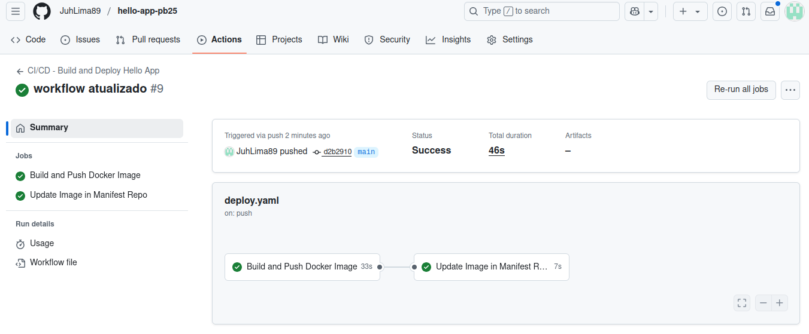


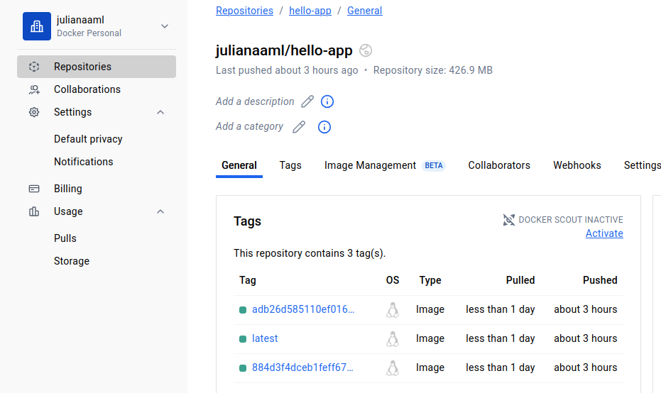

---

### 🔄 2. Atualização Automática dos Manifests

Foi configurado um fluxo de CI/CD para atualizar automaticamente a tag da imagem nos manifests após o build. Isso garante que o ArgoCD faça o deploy da versão mais recente.

**Evidência da atualização automática:**

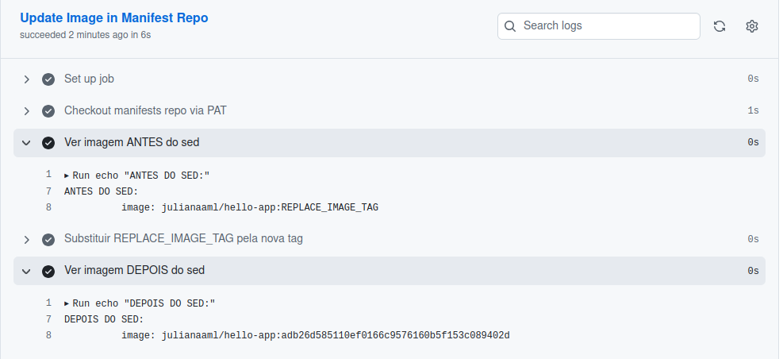


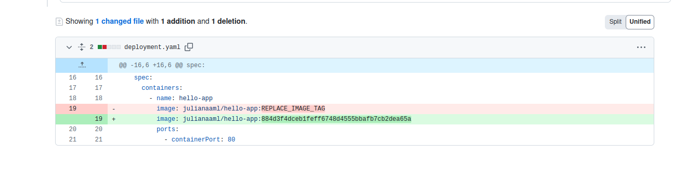


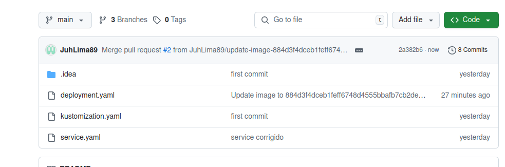

---

### 🚦 3. ArgoCD - Aplicação Sincronizada

A aplicação foi sincronizada com sucesso via ArgoCD, indicando que a nova versão foi implantada no cluster.

**Evidência:**

Imagem antes da atualização:

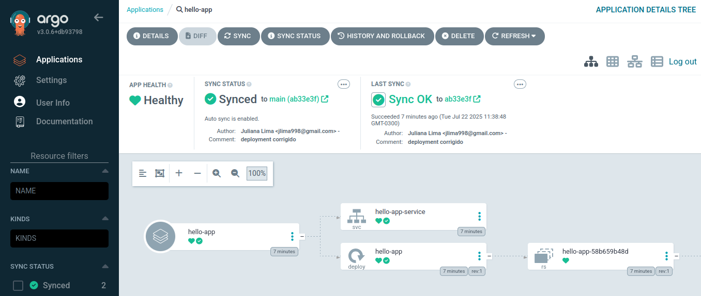

Após atualização com a nova tag da imagem

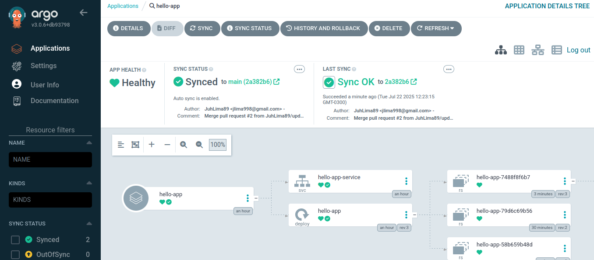


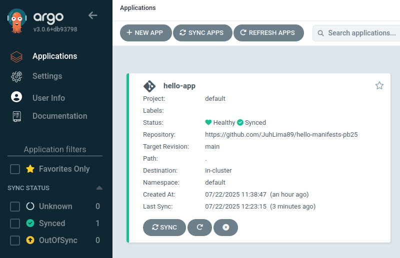

---

### 📦 4. Aplicação Rodando no Cluster

O comando `kubectl get pods` mostra os pods da aplicação em estado **Running**, confirmando que o deploy foi realizado com sucesso.

**Comando usado:**

```bash
kubectl get pods
```

**Evidência:**

Imagem anterior com a tag latest:

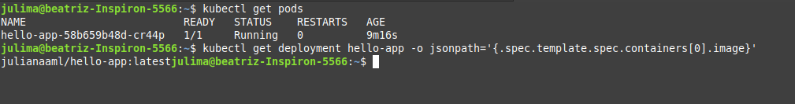

Nova tag na imagem após atualização automática:

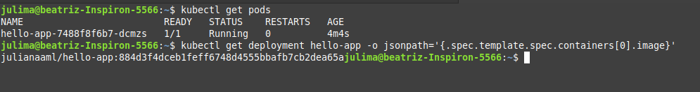

---

### 🌐 5. Aplicação Respondendo

Foi realizado o acesso à aplicação via navegador, http://localhost:8080 e ela respondeu corretamente.

**Evidência:**

Mensagem original:

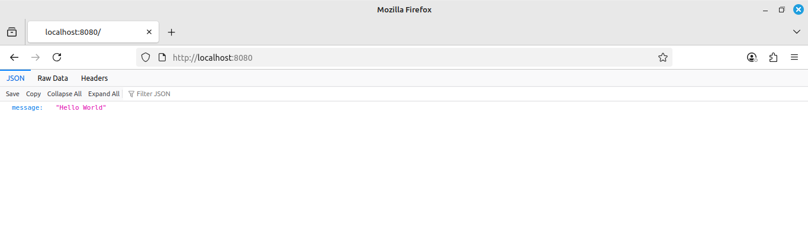

Mensagem modificada:

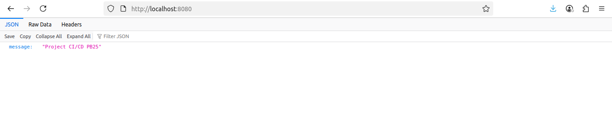

---

## 🛠️ Tecnologias Utilizadas

- Docker
- Kubernetes (Rancher Desktop)
- ArgoCD
- GitHub Actions
- Linux

---

## 📂 Estrutura do Repositório


```
hello-app-pb25/
├── .github/
│   └── workflows/
│       └── deploy.yaml
├── Dockerfile
├── main.py
├── requirements.txt
└── README.md
```
## Deploy com Manifests

Os manifests Kubernetes usados para fazer o deploy dessa aplicação estão disponíveis no repositório:

[hello-manifests-pb25](https://github.com/JuhLima89/hello-manifests-pb25)

### 2. Repositório de Manifests Kubernetes: `hello-manifests-pb25`

```
hello-manifests-pb25/
├── deployment.yaml
├── kustomization.yaml
└── service.yaml
```
---

## ✍️ Autor(a)

Juliana Lima  
